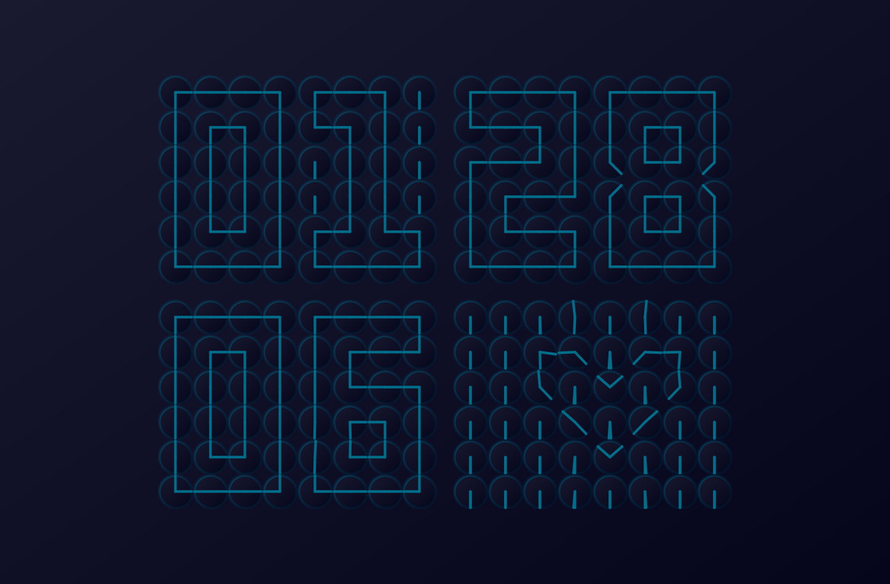
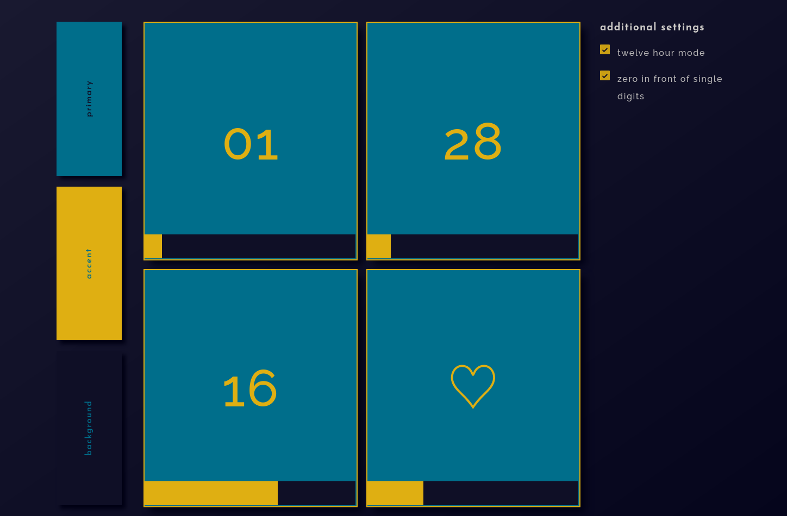
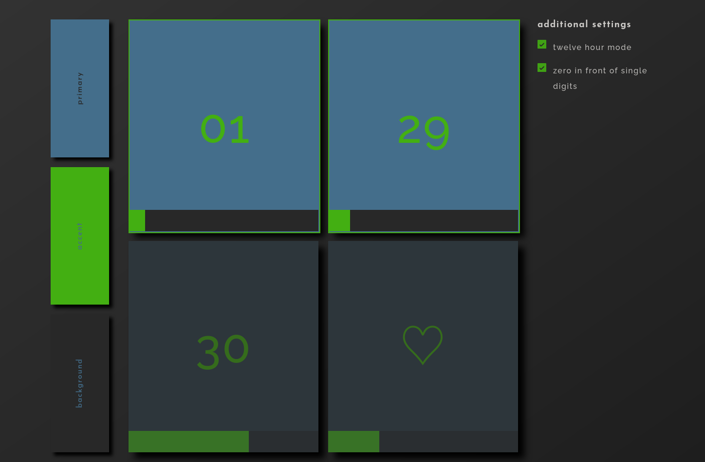
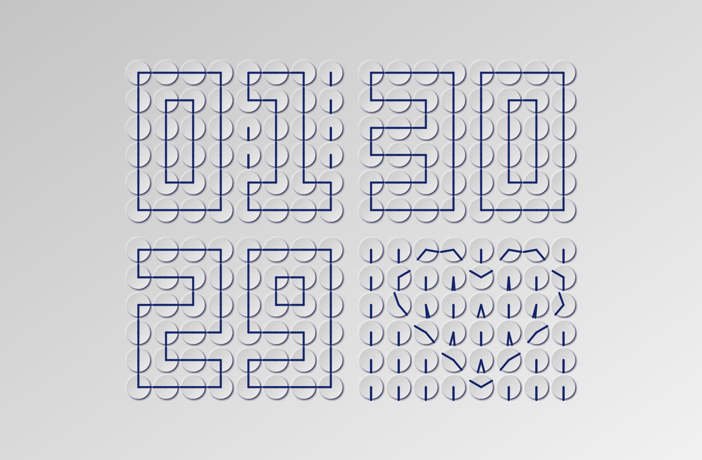

  
  <h1 align="center">Clocktor</h1>
  

    <strong>I have no idea what this name means</strong>

  

  
 Presenting a satisfying digital clock made up of analog clocks, completely in HTML, CSS and JS (the golden trio).

   

## Inspiration

The entire concept is just a digital version of [this
video](https://www.reddit.com/r/Damnthatsinteresting/comments/p6q5pg/a_clock_of_clocks/?share_id=HmzXirarYmTVoQPPbgq1e&utm_medium=ios_app&utm_name=ioscss&utm_source=share&utm_term=1).
If you don't want/can't open it, it's a wall clock where a combination of analog clocks is configured to show digital
numbers.

My initial plan was to include multiple plugins for the fourth display (it currently switches between an arrow and
beating heart). This was around 2015, hence the ancient tech. I just published it now so that maybe you can help me with
the plugins, or maybe use this as a fossil for knowledge in today's Copilot-Claude era.

## Features

- Light and Dark mode
- Customisable color palette
- 12/24 hour format
- Speed control
- ***king satisfying

## Screenshots

 

## License

This project is licensed under the **Creative Commons Attribution-NonCommercial-ShareAlike 4.0 International License**.

You are free to:

* **Share** — copy and redistribute the material in any medium or format
* **Adapt** — remix, transform, and build upon the material

Under the following terms:

* **Attribution** — You must give appropriate credit to **drexfall**, provide a link to the license, and
  indicate if changes were made. You may do so in any reasonable manner, but not in any way that suggests the licensor
  endorses you or your use.
* **NonCommercial** — You may not use the material for commercial purposes.
* **ShareAlike** — If you remix, transform, or build upon the material, you must distribute your contributions under the
  same license as the original.

For more details, see the [LICENSE](LICENSE) file.

## Support

For issues or feature requests (which, I have no idea why one would have), please create an issue in the repository .
